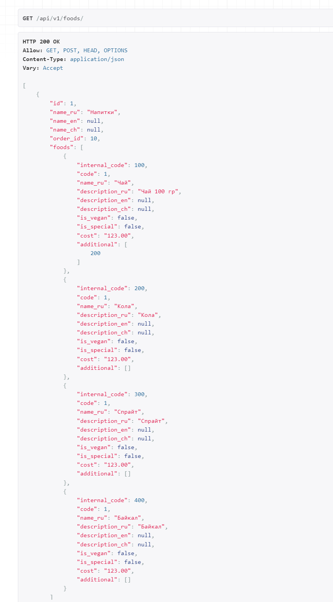

## Инструкция по разворачиванию приложения

1) Скачайте репозиторий, у бедитесь что у вас установлен Python откройте командную строку 
2) Прейдите в директорию с проектом
3) Устанавливаем все необходимые пакеты ```pip install -r requirements.txt``` or ```pip3 install -r requirements.txt``` 
4) Выполните команду python manage.py makemigrations и python manage.py migrate
5) Для запуска приложения введите python manage.py runserver or python3 manage.py runserver
6) Для загрузки fixtures перейдите в директорию CodingTeam/ и выполните команду load_fixtures.sh
7) Прейдите по адресу http://127.0.0.1:8000/api/v1/foods/
  



